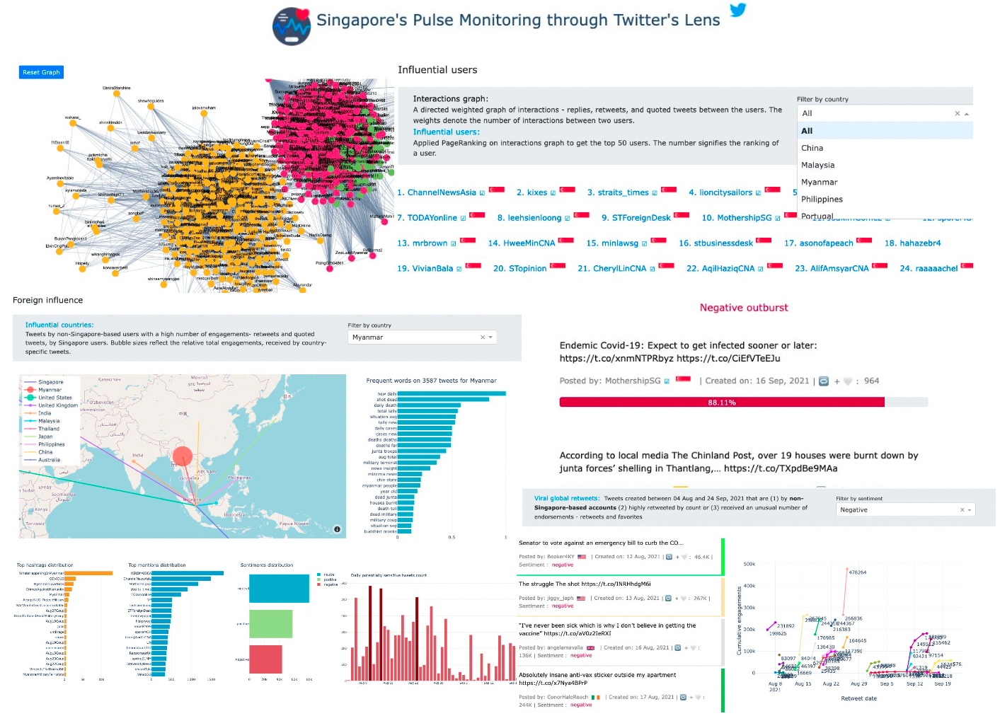

# Singapore-based geocoded tweets analysis

This is a general dashboard for analysing Singapore-based tweets. The key insights include:
- Influential users by country 
- Influential countries and analysing tweets from those countries 
- Communities/clusters - the networking graph, tweets analysis, users in the clusters
- Reactive tweets (among the most quoted tweets) - tweets that received extreme sentiments
- Viral local retweets by sentiment (By Singapore-based users' accounts)
- Viral global retweets by sentiment (By non Singapore-based users' accounts)
- Potentially sensitive tweets analysis
- Popular mentions and hashtags
- Sentiment analysis 
- Tweets counts on a daily basis 
- Basic stats - total tweets, avg no. of tweets per day, no. of unique users and so on
  

Checkout the [demo](http://sg-tweets-monitoring.herokuapp.com/) here. 

The repository contains code for: 
- Fetching Singapore-based offcial accounts followers 
- Filtering Singapore-based tweets that are ingested into MangoDB 
- Notebooks containing exploratory data analysis on the collected tweets
- Pipeline for generating key insights i.e. dashboard data (csv abd json files)
- Plotly Dash application for visualizing the insights

--------------------------------------------------------------------------------

## Content

<!-- toc -->
- [Singapore-based users' tweets collection](#usage)
  <!-- - [Training Samples](#training-samples)
  - [Evaluation Sample](#evaluation-sample) -->
- [Data Insights](#license)
- [Setup](#setup)
- [Future Work](#future-work)
<!-- tocstop -->

### Singapore-based users' tweets collection
The major challenge and common problem in research is that  less than 0.1% of the tweets have a GPS location data. 
So how to figure out if a tweet's user is Singapore-based and also collect a sufficient number of tweets for analysis?  
I developed these credible heuristics and wrote an algorithm for filtering Singapore-based tweets.  
The data analysis showed the collected tweets gave insights specific to Singapore. 

The data analyses suggest that curated tweets give credible insights about Singapore. 
First, the Twitter streaming data is ingested into MongoDB, curate Singapore-based tweets using heuristics. 
And then comprehensive exploratory data analysis is performed on the curated tweets. 

### Data Insights

## Setup 

<!-- 
**Challenge**: Collecting tweets by ***Singapore-based users*** from streaming Twitter data.

--------------------------------------------------------------------------------

### Insights are presented on the dashboard with the help of visualizations.  -->

