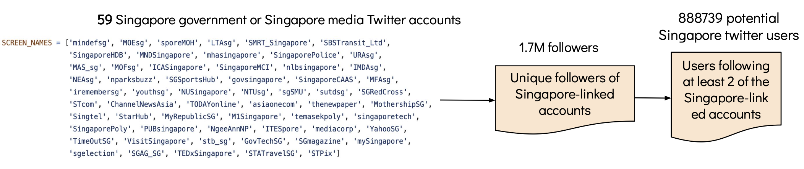

# :round_pushpin:	 Geocoded Tweets Analysis Dashboard :chart_with_downwards_trend:	 :chart_with_upwards_trend:	:bar_chart:	

This is an **interactive**, **configurable** and **generic** dashboard. 
It helps in visualizing some key insights from tweets of **country-specific** or **global** users. 

> The application is built using [Plotly Dash](https://plotly.com/dash/).

The key insights include:

:small_orange_diamond: &nbsp; Top influential users and their country <br />
:small_orange_diamond: &nbsp; Top influential countries and analyzing tweets from those countries <br />
:small_orange_diamond: &nbsp; Communities of users; networking graph and communities' tweets analysis <br />
:small_orange_diamond: &nbsp; Reactive tweets (viral tweets through quotes with extreme sentiments) <br />
:small_orange_diamond: &nbsp; Viral local tweets through retweets (By users based in the specified country. For global level, viral local tweets are ignored <br />
:small_orange_diamond: &nbsp; Viral global tweets through retweets (By users NOT based in the specified country.) <br />
:small_orange_diamond: &nbsp; Potentially sensitive tweets analysis <br />
:small_orange_diamond: &nbsp; Popular mentions and hashtags <br />
:small_orange_diamond: &nbsp; Sentiment analysis <br />
:small_orange_diamond: &nbsp; Daily tweets counts <br />
:small_orange_diamond: &nbsp; Basic statistics - total tweets, avg no. of tweets per day, no. of unique users, and date range of the collected tweets <br />
  
***These insights can help the regulatory agencies and decision-makers in taking appropriate action.***


Checkout the demos for: 
- Country-specific tweets:
    - :singapore:	&nbsp; [Singapore](https://sg-tweets-monitoring.herokuapp.com/) 
    - :india: &nbsp; [India](http://in-tweets-monitoring.herokuapp.com/)
    - :us:	&nbsp; [United States](http://us-tweets-monitoring.herokuapp.com/)
- :earth_americas:&nbsp; [Global tweets](https://global-tweets-monitoring.herokuapp.com/) 

## Content

<!-- toc -->
- [Overview](#overview)
- [Visualizing the key insights from the sample tweets data](#visualizing-the-key-insights-from-the-sample-tweets-data)
  - [Manual Setup](#manual-setup)
  - [Using Docker](#using-docker)
- [Visualizing the key insights from custom country-specific or global level tweets data](#visualizing-the-key-insights-from-custom-country-specific-or-global-level-tweets-data)
- [Additional step for Singapore-based users tweets collection](#additional-step-for-singapore-based-users-tweets-collection)
<!-- - [Future Work](#future-work) -->
<!-- tocstop -->


## Overview

The repository contains code for:
- Geocoding tweets by using location, user description, place, and coordinates data
- Filtering country-specific tweets that are ingested into MongoDB
- Notebooks containing exploratory data analysis on the collected tweets
- Pipeline for tweets processing and cleaning. 
- Pipeline for generating key insights i.e., dashboard data (csv and json files)
- Plotly dash application for visualizing the insights
- Fetching followers of 59 Singapore-based official accounts (such as Ministry of Education, Health, and so on)

Refer to this detailed [documentation](https://docs.google.com/document/d/1jr9FAraF93lWkf3H2HbpLlMsTxVcQk-JTRa6JuJuJPA/edit?usp=sharing). The documentation provides details on the collected data, geocoding, approach towards key insights generation, implementation using python, and so on.

# Visualizing the key insights from the sample tweets data

Download the sample data from [this]() link and keep the `data` folder at the root level.

## Manual Setup

- Git clone the repository 

```
git clone https://github.com/anshu0612/geocoded-tweets-analysis.git
```

- Install dependencies

```
pip3 install -r requirements.txt
```
- Run the application on your local
```
python3 app.py
```

- Hit http://localhost:5000/ to see the application running :rocket:. 

## Using Docker

If you face environment dependencies then you can use **docker** instead. 

- Clone the repository 
- Install Docker on your system 

- Run the below command to build the docker image
```
docker image build -t geocoded-tweets-insights-dash:latest .
```

- Run the docker image 
```
docker container run -d -p 5000:5000 geocoded-tweets-insights-dash
```

- Hit http://localhost:5000/ to see the application running :rocket:. 

# Visualizing the key insights from custom country-specific or global level tweets data

The application starts processing tweets that are ingested into the remote MongoDB server.


####  Step 1: Setup MongoDB configurations 

Create an .env file, and add the below required details for fetching tweets from MongoDB
```python
MONGO_HOST = <mongo_host>
MONGO_USER = <mongo_username>
MONGO_PASS = <mongo_password>
```

> You can update the `get_tweets.py` file for any other source of tweets data


####  Step 2: Update the `constants/country_config.py` file

For collecting country-specific tweets
```python
# (String) Should be Alpha2 country code
# Check `COUNTRY_TO_ALPHA2` for reference in constants/commmon.py file
# Example: 'SG'
COUNTRY_CODE = None

# (List) of country slangs
# Example 1: ['sg', 'spore', 'singapore', 'singapura']
# Example 2: ['United States', 'america', 'usa', 'us', 'united states of america', 'u.s.', 'states', 'u.s.a']
# --------- USE: ---------
# 1. Helps in estimating a user's location based on the country name slangs
# 2. Filtering tweets based on the country name slangs  present in 
#    `location description` and `profile description` of a user
# 3. Skip the country name slangs from the top hashtags
COUNTRY_SLANGS = []

# (Dictionary) - {<twitter_user_screen_name>: <twitter_user_country_code>} - Prior knowledge of a user's country
# Example {'muttons': 'SG', 'POTUS': 'US'}
KNOWN_USERNAMES_COUNTRIES = {}
```

--------------------------------------------------------------------------------
> :heavy_exclamation_mark: **Important:** Do not update the file if you intend to collect global tweets from the users 
--------------------------------------------------------------------------------


####  Step 3: Collect tweets 

Sample command to run the python script to collect the tweets
```bash
python3 get_tweets.py --db_name COVID_VACCINE --collection_no_list 88 89
```

**Arguments**
| Argument | Description | Default
| ---- | --- | --- |
| db_name | Database name to fetch tweets from | - |
| collection_no_list | List of MongoDB collections | - |
| running_tweets_save_count | Number of tweets to save during tweets processing | 1000 |
| max_csv_tweets_count | Maximum no. of tweets to save in a csv | 10000 |

The csv files for the: 
- The **country-specific** tweets will be saved in `data/<country>/fragmented_tweets/tweets` and `data/<country>/fragmented_tweets/tweets/tweets_engagements` directories
- The **global** tweets will be saved in `data/global/fragmented_tweets/tweets` and `data/global/fragmented_tweets/tweets_engagements` directories

####  Step 4: &nbsp; Process tweets 

Run the python script to process the tweets
```bash
python3 process_tweets.py
```

This will merge and join all the csvs files, and then do the required processing. 

The generated file will be stored in:
- For **country-specific** tweets: `data/<country>/<country>_tweets.csv`
- For **global** tweets: `data/global/global_tweets.csv`

####  Step 5: Generate dashboard data  

Run the python script to generate data for the dashboard
```bash
python3 generate_dash_data.py
```
> You can setup the dashboard related constants in the `data/dash_constants.py`

This will create the necessary `csv` and `json` data files for the dashboard visualization.

The generated data directories containing the files will be stored in:
- For **country-specific** tweets: `data/<country>/dash_output/....`
- For **global** tweets: `data/global/dash_output/....`

####  Step 6: Run the application
Yay! If you successfully ran all the above steps, then go ahead and run the application. :partying_face:	

```bash
python3 app.py
```

# Additional step for Singapore-based users tweets collection

Since I started building the dashboard for Singapore, there is an additional step, can say, Step 0 for Singapore-based users' tweets collection.  

The step involves collecting Twitter users who follow at least `X` number of Singapore-linked official accounts (such as Ministry of Education, Health, and so on). The heuristic is to know the potential Singapore-based users and subsequently collect tweets from those users. 

The provided sample of users in `data\singapore\min_following_users.txt` lists the users who follow at least `2` of the `59 Singapore-linked official accounts` (check the diagram below for your reference). During tweets collection, this file is used - as one of the steps -   to filter Singapore-based tweets. 



#### Collecting followers of the Singapore-linked official accounts`

Running the below command fetches the followers of the `59 Singapore-based official accounts`. 
```bash
python3 get_sg_users.py --min_following_required 2
```
**Arguments**

| Argument | Description | Default
| ---- | --- | --- |
| min_following_required | Filter users following at least these number of Singapore-based official accounts | 2 |

The file `data/singapore/min_following_users.txt` contains the user ids of the collected twitter Singapore-based official accounts.

> The list of followers will be saved in `data/singapore/sg_accounts_followers/` folder.

To collect the followers using the Twitter API, add the credentials in the `.env` file 

```python
TWITTER_APP_KEY = 'XXXX'
TWITTER_APP_SECRET = 'XXXX'
TWITTER_OAUTH_TOKEN = 'XXXX'
TWITTER_OAUTH_TOKEN_SECRET = 'XXXX'
```

# Contact

If you have any questions, feel free to open an issue or directly contact me via: `anshu@comp.nus.edu.sg` or `anshu.singh173@gmail.com`

# Acknowledgement 
Thanks, Christian von der Weth (@chrisvdweth) and Jithin Vachery (@jithinvachery) for the guidance.  
@chrisvdweth provided the list of Singapore-linked official accounts. 
